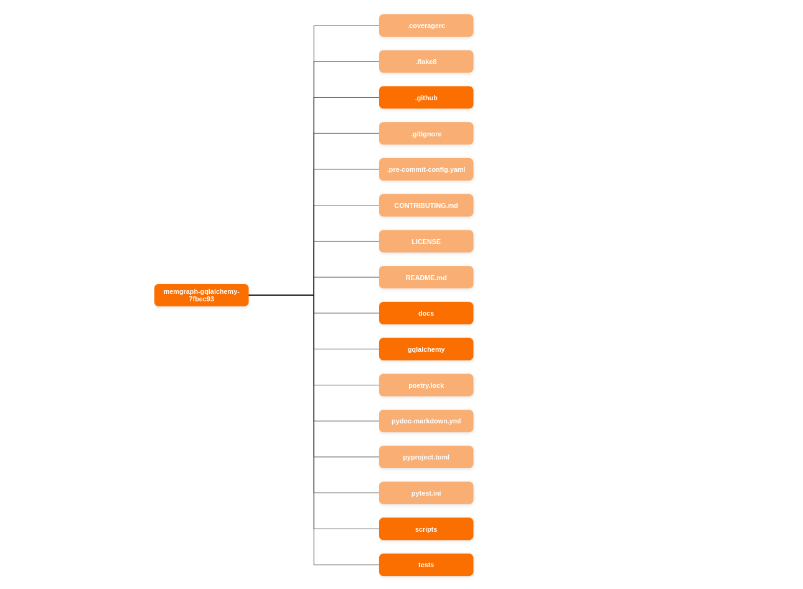
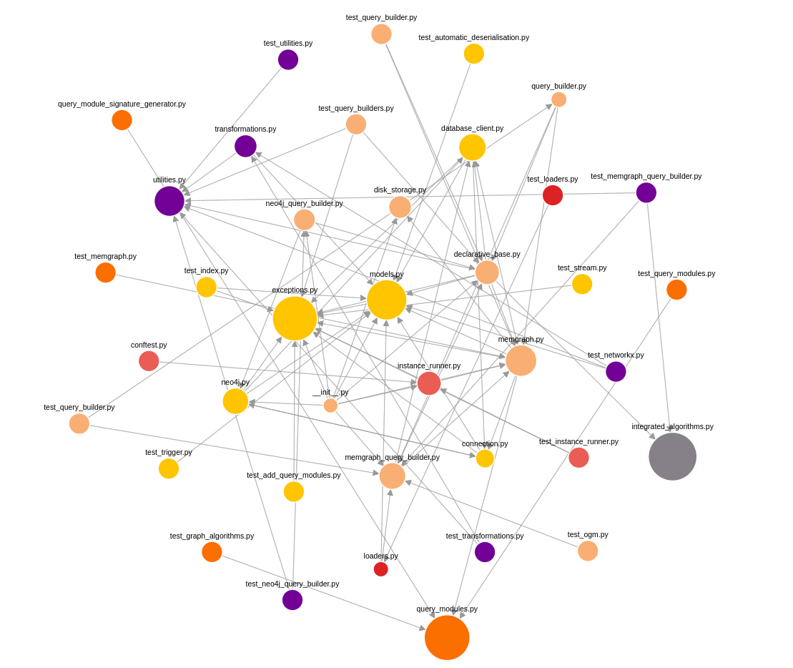

<a id="readme-top"></a>

<br />
<div align="center">
  <a href="https://github.com/othneildrew/Best-README-Template">
    
  </a>

  <h3 align="center">GitHub Code Analyser</h3>

  <p align="center">
    The go-to place for fast and accurate analysis of your GitHub repositories!
    <br />
  </p>
</div>


<!-- TABLE OF CONTENTS -->
<details>
  <summary>Table of Contents</summary>
  <ol>
    <li>
      <a href="#about-the-project">About The Project</a>
      <ul>
        <li><a href="#available-graphs">Available graphs</a></li>
        <li><a href="#built-with">Built With</a></li>
      </ul>
    </li>
    <li>
      <a href="#getting-started">Getting Started</a>
      <ul>
        <li><a href="#step1">Step #1 - download repository</a></li>
        <li><a href="#step2">Step #2 - environment variables</a></li>
        <li><a href="#step3">Step #3 - setup GitHub App</a></li>
        <li><a href="#installation">Installation</a></li>
      </ul>
    </li>
    <li><a href="#license">License</a></li>
  </ol>
</details>


<!-- ABOUT THE PROJECT -->
## About The Project

<a id="about-the-project"></a>

[![Index Page][index-page-screenshot]]()

The GitHub Code Analyser is the perfect place for fast and accurate analysis of your GitHub repositories. 
The project was made during my Memgraph summer internship, and my main motive was to create a graph where users could see how each file interacts with other files in a GitHub repository. 
My side motives were to show that Memgraph can handle large quantities of dynamically generated data, and to show that with Memgraph you can model user oriented data including user authentication.

<br />

The application offers the following features:
* Users can use their GitHub account to log in to the application
* Users can see the repositories they have access to or search specific repositories
* File Tree graph
* Dependency graph
<p align="right">(<a href="#readme-top">back to top</a>)</p>


### Available graphs

<a id="available-graphs"></a>

<p align="center">
  
&nbsp; &nbsp; &nbsp; &nbsp;
  
</p>

The graph on the left is the File Tree graph. 
The graph on the right is the Dependency graph. 
With the dependency graph, you can see how each file interacts with other files in the repository. 
The size of the node is proportional to the number of files that depend on it. 
The color of the node represents a group the file should be a part of.


### Built With
<a id="built-with"></a>

* [![Next][Next.js]][Next-url]
* [![React][React.js]][React-url]
* [![Python][Python.org]][Python-url]
* [![Memgraph][Memgraph]][Memgraph-url]
* [![TypeScript][TypeScript]][TypeScript-url]
* [![Material-UI][Material-UI]][Material-UI-url]
* [![Docker][Docker]][Docker-url]
* [![Kafka][Kafka]][Kafka-url]

<p align="right">(<a href="#readme-top">back to top</a>)</p>


<!-- GETTING STARTED -->
## Getting Started

<a id="getting-started"></a>

To get a local copy up and running follow these simple example steps.

### Step #1 - download repository

<a id="step1"></a>
    
```sh
git clone https://github.com/memgraph/github-code-analysis
```

### Step #2 - environment variables

<a id="step2"></a>

You'll need to create a `.env` file in `./backend`. It should look like this:
    
```
SECRET_REGISTRATION_KEY=<your secret registration key>
  ```
You will also need to create a `.env.local` file in `./frontend`. It should look like this:
    
```
AUTH_SECRET=<auth key for github autorization - used for jwt token>
NEXTAUTH_URL=http://localhost:3001
NEXTAUTH_BACKEND_URL=http://backend:5000
BACKEND_URL=http://localhost:5000
GITHUB_PERMS=repo read:org read:packages read:project read:repo_hook read:user
GITHUB_CLIENT_ID=
GITHUB_CLIENT_SECRET=
SECRET_REGISTRATION_KEY=<same secret registration key from backend .env>
  ```


### Step #3 - setup GitHub App

<a id="step3"></a>

Go to `https://github.com/settings/apps` and create a new App.

The name can be anything you want, but the Homepage URL should be `http://localhost:3001` and the callback URL should be `http://localhost:3001/api/auth/callback/github`. Please select Expire user authorization tokens and Request user authorization (OAuth) during installation.
You don't have to enable Device Flow and you can skip post installation setup. You can also ignore the webhooks.

#### The permissions you need to select

Repository permissions:
* Administration: Read-only
* Checks: Read-only
* Commit statuses: Read-only
* Contents: Read-only
* Metadata: Read-only
* Pull requests: Read-only

Organization permissions:
* Administration: Read-only

User permissions:
* Statuses: Read-only

Everything else set to no access.

Copy and paste the Client ID and Client Secret from the App settings to the `.env.local` file in `./frontend`.

### Installation

<a id="installation"></a>

Position yourself in the root directory of the project and run the following commands:
```sh
chmod +x ./setup.sh
./setup.sh
```

<p align="right">(<a href="#readme-top">back to top</a>)</p>


<!-- LICENSE -->
## License

<a id="license"></a>

Distributed under the MIT License. See `LICENSE` for more information.

<p align="right">(<a href="#readme-top">back to top</a>)</p>


<!-- MARKDOWN LINKS & IMAGES -->
[index-page-screenshot]: readmedata/images/index_page.png
[filetree-screenshot]: readmedata/images/filetree.png
[dependency-screenshot]: readmedata/images/dependencies.png
[Next.js]: https://img.shields.io/badge/next.js-000000?style=for-the-badge&logo=nextdotjs&logoColor=white
[Next-url]: https://nextjs.org/
[React.js]: https://img.shields.io/badge/React-20232A?style=for-the-badge&logo=react&logoColor=61DAFB
[React-url]: https://reactjs.org/
[Python.org]: https://img.shields.io/badge/Python-3776AB?style=for-the-badge&logo=python&logoColor=white
[Python-url]: https://www.python.org
[Material-UI]: https://img.shields.io/badge/Material--UI-0081CB?style=for-the-badge&logo=material-ui&logoColor=white
[Material-UI-url]: https://material-ui.com/
[Memgraph]: https://img.shields.io/badge/Memgraph-FB6E00?style=for-the-badge&logo=memgraph&logoColor=white
[Memgraph-url]: https://memgraph.com/
[Kafka]: https://img.shields.io/badge/Apache%20Kafka-231F20?style=for-the-badge&logo=apachekafka&logoColor=white
[Kafka-url]: https://kafka.apache.org/
[Typescript]: https://img.shields.io/badge/TypeScript-007ACC?style=for-the-badge&logo=typescript&logoColor=white
[Typescript-url]: https://www.typescriptlang.org/
[Docker]: https://img.shields.io/badge/Docker-2CA5E0?style=for-the-badge&logo=docker&logoColor=white
[Docker-url]: https://www.docker.com/
